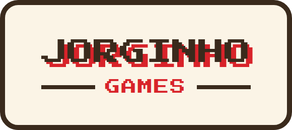

<p align="center">
  
</p>

<p align="center">
  <strong><a href="https://alvesian.github.io/jorginho_games/">▶ Jogar agora</a></strong><br>
  <sub>alvesian.github.io/jorginho_games</sub>
</p>

Coleção de mini-jogos em HTML/CSS/JS puro, sem dependências nem build. Cada jogo vive na sua própria pasta dentro de `games/` e o [`index.html`](index.html) da raiz é o hub que lista todos.

## Jogos

| Jogo | Pasta | Descrição |
| --- | --- | --- |
| **Jorginho vai ao Chiquinho** | [`games/jorginho-vai-ao-chiquinho/`](games/jorginho-vai-ao-chiquinho/) | Atravesse as ruas cheias de trânsito e leve o Jorginho até a sorveteria do Chiquinho. Setas ou WASD para andar, um passo por vez. |

## Como rodar

A versão publicada está em **<https://alvesian.github.io/jorginho_games/>** — todo merge na `main` atualiza o site automaticamente via GitHub Pages.

Para rodar localmente, é tudo estático — basta servir a raiz do repositório:

```bash
python3 -m http.server 8000
```

E abrir <http://localhost:8000>. (Abrir o `index.html` direto no navegador também funciona.)

## Como adicionar um jogo novo

1. Crie a pasta `games/<slug-do-jogo>/` com um `index.html` (e os `style.css` / `game.js` que precisar). O jogo deve ser autocontido dentro da pasta.
2. Adicione uma entrada no array `GAMES` do [`index.html`](index.html) da raiz (slug, emoji, título e descrição) — o card no hub é gerado a partir dela.
3. Inclua no jogo um link de volta pro hub (`../../index.html`), como no Jorginho vai ao Chiquinho.

## Estrutura

```
.
├── index.html                        # hub com a lista de jogos
└── games/
    └── jorginho-vai-ao-chiquinho/
        ├── index.html                # marcação e HUD
        ├── style.css                 # visual
        └── game.js                   # lógica e render (3D em CSS transforms)
```
